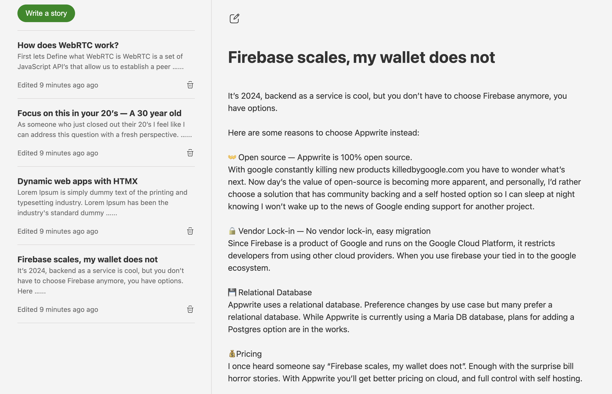

# Django-HTMX Mediam styled blog clone

A Django website made dynamic with HTMX. The purpose of this project is to demonstrate the capabiliites of HTMX while showcasing the flexibility it adds to a the a template engine.

To install:

-   `git clone <REPO_URL>` - Clone this repo
-   `cd djangohtmx` - CD into the project folder
-   `pip install -r requirements.txt` - Install all requirements
-   `python manage.py runserver` - Run server

